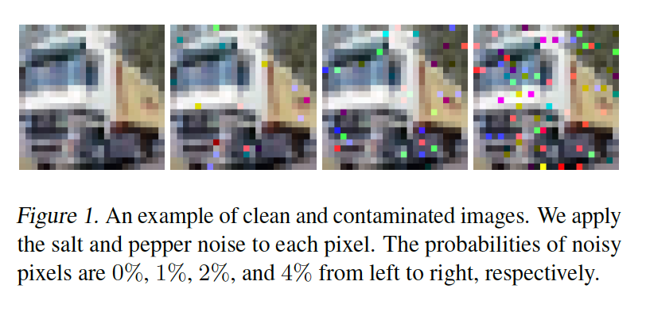
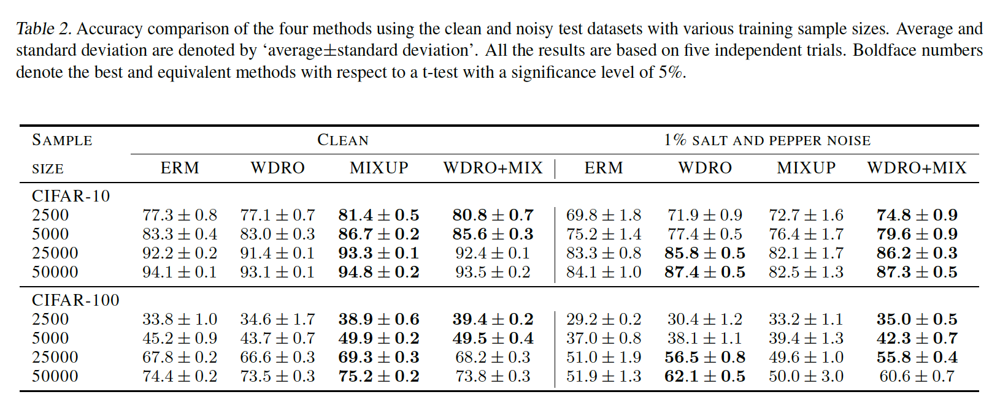

# Principled learning method for Wasserstein distributionally robust optimization with local perturbations
This repository provides the Python implementation of the paper "Principled Learning Method for Wasserstein Distributionally Robust Optimization with Local Perturbations" accepted for [ICML 2020](https://icml.cc/Conferences/2020/AcceptedPapersInitial). [[Paper link]](https://arxiv.org/abs/2006.03333)

## Example results
- Example of clean and noisy samples.


- Accuracy comparison result. When data are noisy, the proposed method shows robustness.


## Create virtual environment
```
sudo apt install python3-dev python3-virtualenv python3-tk imagemagick
virtualenv -p python3 --system-site-packages WDRO
source WDRO/bin/activate
```

## Install dependencies
```
cd DIRECTORY_TO_CLONED_FILE
pip3 install -r requirements.txt
```

## Download and install datasets
```
# Download CIFAR-10 CIFAR-100
CUDA_VISIBLE_DEVICES= python3 ./input/create_datasets.py cifar10 cifar100

# Create the 5 independent training sets
for seed in 1 2 3 4 5; do
  for size in 2500 5000 25000 50000; do
    CUDA_VISIBLE_DEVICES= python3 ./input/create_split.py --seed=$seed 
    --size=$size ./input/cifar10/cifar10 ./input/cifar10-train.tfrecord
    CUDA_VISIBLE_DEVICES= python3 ./input/create_split.py --seed=$seed 
    --size=$size ./input/cifar100/cifar100 ./input/cifar100-train.tfrecord
  done
done
```
This code produces `tfrecord` files in `./input/cifar10` and `./input/cifar100`.  Each `tfrecord` file has the form: `${dataset}.${seed}@${train_size}-{valid_size}`.

## Quick start
The codes below are for the implementation of experiments in Section 5. `train.sh` trains a model using ERM, WDRO, MIXUP, and WDRO+MIX, `section_5_1.sh` evaluates accuracy using contaminated dataset as in Section 5.1, and `section_5_2.sh` calculates the gradients of a loss as in Section 5.2. The number of GPU devices is required to run this code.
```
sh runs/train.sh
sh runs/section_5_1.sh
sh runs/section_5_2.sh
```


## Train models
Train ERM with weight decay 0.02 and smoothing 0.001 for 100 epochs.
```
for seed in 1 2 3 4 5; do
  for size in 2500 5000 25000 50000; do
    CUDA_VISIBLE_DEVICES= python3 erm.py --dataset=cifar10.$seed@$size-1 --wd=0.02 
    --smoothing 0.001 --nckpt 100
    CUDA_VISIBLE_DEVICES= python3 erm.py --dataset=cifar100.$seed@$size-1 --wd=0.02 
    --smoothing 0.001 --nckpt 100
  done
done
```

Train MIXUP for 100 epochs.
```
for seed in 1 2 3 4 5; do
  for size in 2500 5000 25000 50000; do
    CUDA_VISIBLE_DEVICES= python3 mixup_grad.py --dataset=cifar10.$seed@$size-1 
    --nckpt 100
    CUDA_VISIBLE_DEVICES= python3 mixup_grad.py --dataset=cifar100.$seed@$size-1 
    --nckpt 100
  done
done
```

Train WDRO for 100 epochs.
```
for seed in 1 2 3 4 5; do
  for size in 2500 5000 25000 50000; do
    CUDA_VISIBLE_DEVICES= python3 erm.py --dataset=cifar10.$seed@$size-1 
    --gamma 0.004 --nckpt 100
    CUDA_VISIBLE_DEVICES= python3 erm.py --dataset=cifar100.$seed@$size-1 
    --gamma 0.004 --nckpt 100
  done
done
```

Train WDRO+MIX for 100 epochs.
```
for seed in 1 2 3 4 5; do
  for size in 2500 5000 25000 50000; do
    CUDA_VISIBLE_DEVICES= python3 mixup_grad.py --dataset=cifar10.$seed@$size-1 
    --gamma 0.004 --nckpt 100
    CUDA_VISIBLE_DEVICES= python3 mixup_grad.py --dataset=cifar100.$seed@$size-1 
    --gamma 0.004 --nckpt 100
  done
done
```
Each trained model is saved at `./experiments/METHOD_NAME/cifar10 (or cifar100).$seed@$size-1/tf, args` directory. In addition, train, validation and test accuracy evaluated on each epochs are saved at `./experiments/METHOD_NAME/cifar10 (or cifar 100).$seed@$size-1/accuracies.txt`.


## Evaluation of accuracy with contaminated images (Section 5.1)
```
for seed in 1 2 3 4 5; do
  for size in 2500 5000 25000 50000; do
    for dataset in cifar10 cifar100; do
      CUDA_VISIBLE_DEVICES= python3 erm.py 
      --eval_ckpt experiments/ERM/$dataset.$seed@$size-1/tf/model.ckpt-06553600 
      -dataset=$dataset.$seed@$size-1 --noise_p 0.01
      CUDA_VISIBLE_DEVICES= python3 erm.py 
      --eval_ckpt experiments/WDRO_0.004/$dataset.$seed@$size-1/tf/model.ckpt-06553600 
      -dataset=$dataset.$seed@$size-1 --noise_p 0.01
      CUDA_VISIBLE_DEVICES= python3 mixup_grad.py 
      --eval_ckpt experiments/MIXUP/$dataset.$seed@$size-1/tf/model.ckpt-06553600 
      -dataset=$dataset.$seed@$size-1 --noise_p 0.01
      CUDA_VISIBLE_DEVICES= python3 mixup_grad.py 
      --eval_ckpt experiments/WDRO_MIX_0.004/$dataset.$seed@$size-1/tf/model.ckpt-06553600 
      -dataset=$dataset.$seed@$size-1 --noise_p 0.01
    done
  done
done
```
Each accuracy on the clean and contaminated datasets is saved at `./experiments/METHOD_NAME/cifar10 (or cifar100).$seed@$size-1/noise.txt`.

## Evaluation of the gradients of a loss (Section 5.2)
```
for steps in 00655360 01310720 01966080 02621440 03276800 03932160 04587520 05242880 05898240 06553600; do
  for seed in 1 2 3 4 5; do
    for size in 2500 5000 25000 50000; do
      for dataset in cifar10 cifar100; do
        CUDA_VISIBLE_DEVICES= python3 erm.py 
	--eval_ckpt experiments/ERM/$dataset.$seed@$size-1/tf/model.ckpt-$steps 
	-dataset=$dataset.$seed@$size-1
        CUDA_VISIBLE_DEVICES= python3 erm.py 
	--eval_ckpt experiments/WDRO_0.004/$dataset.$seed@$size-1/tf/model.ckpt-$steps 
	-dataset=$dataset.$seed@$size-1
        CUDA_VISIBLE_DEVICES= python3 mixup_grad.py 
	--eval_ckpt experiments/MIXUP/$dataset.$seed@$size-1/tf/model.ckpt-$steps 
	-dataset=$dataset.$seed@$size-1
        CUDA_VISIBLE_DEVICES= python3 mixup_grad.py 
	--eval_ckpt experiments/WDRO_MIX_0.004/$dataset.$seed@$size-1/tf/model.ckpt-$steps 
	-dataset=$dataset.$seed@$size-1
      done
    done
  done
done
```
The l-infinity norm of the gradients is saved at `./experiments/METHOD_NAME/cifar10 (or cifar100).$seed@$size-1/gradients-$steps.txt`.

## Directory tree

```bash
.
├── input
│   ├── create_datasets.py
│   └── create_split.py
├── libml
│   ├── data.py
│   ├── dtype.py
│   ├── layers.py
│   ├── models.py
│   ├── noise.py
│   ├── train.py
│   └── utils.py
├── runs
│   ├── section_5_1.sh
│   ├── section_5_2.sh
│   └── train.sh
├── erm.py
├── mixup_grad.py
├── README.pdf
└── requirements.txt
```

## Disclaimer
This code has been modified from the original version at https://github.com/google-research/mixmatch


